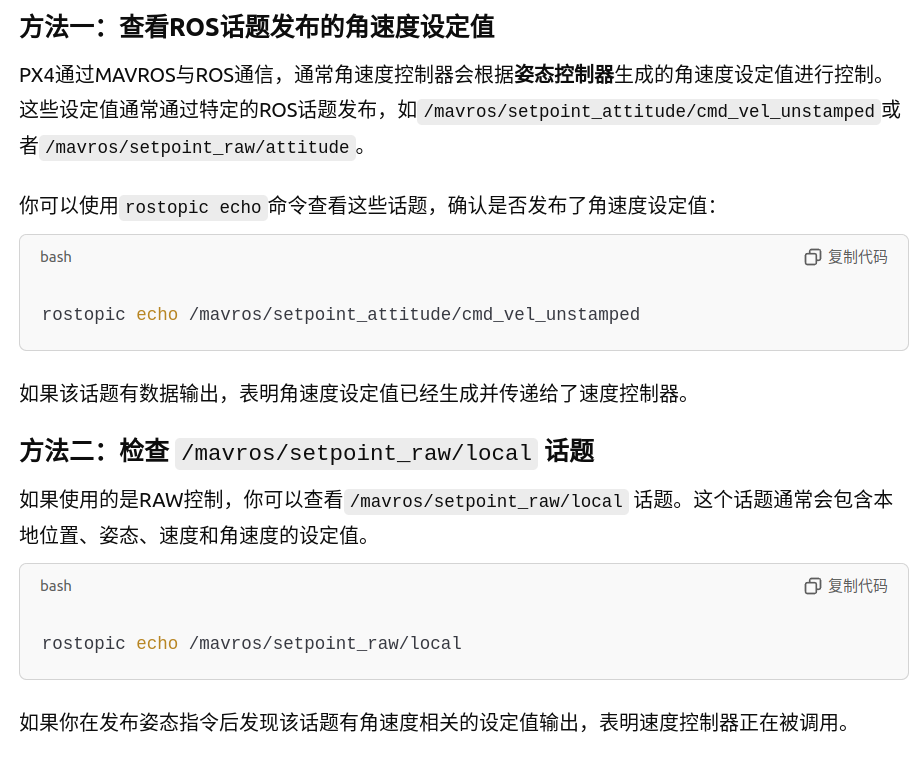
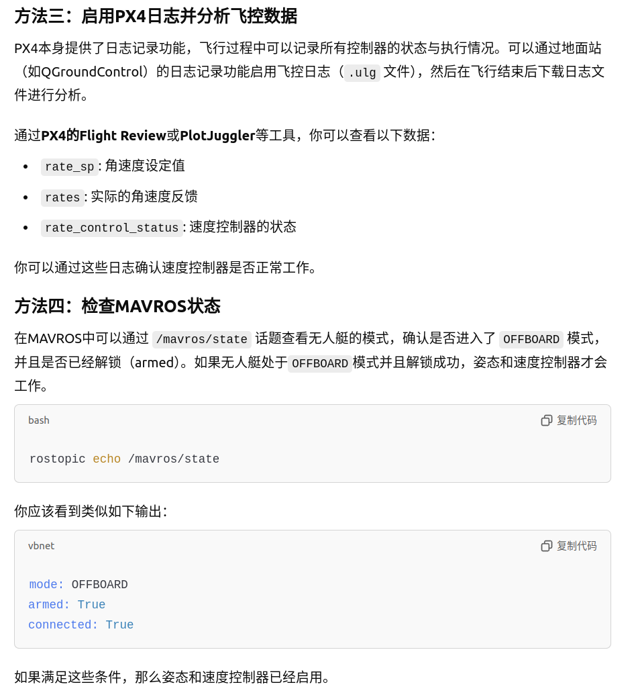
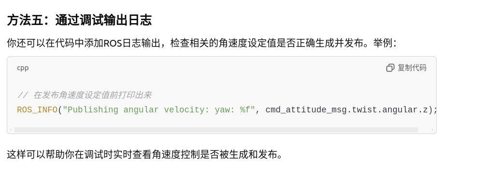

1. 你可以使用rostopic echo命令查看这些话题，确认是否发布了角速度设定值：
rostopic echo /mavros/setpoint_attitude/cmd_vel_unstamped

2. rostopic echo /mavros/setpoint_raw/local

3. rostopic echo /mavros/state
// 在发布角速度设定值前打印出来
ROS_INFO("Publishing angular velocity: yaw: %f", cmd_attitude_msg.twist.angular.z);
